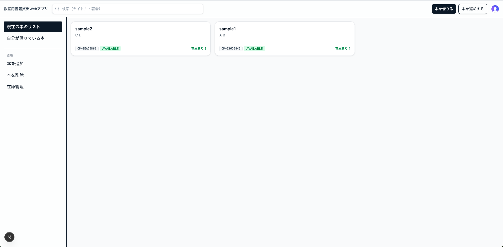
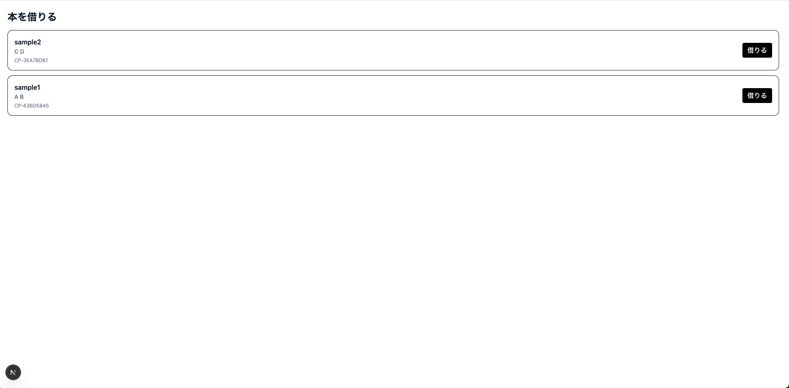
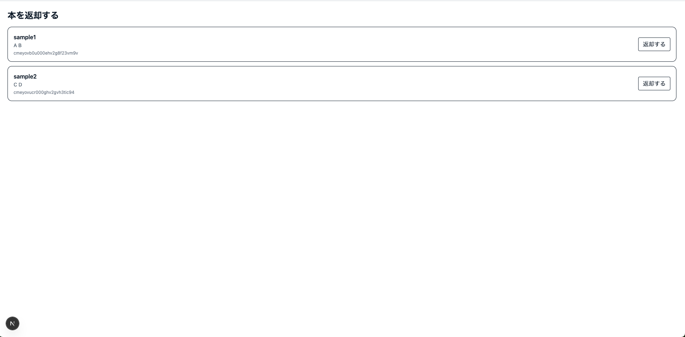
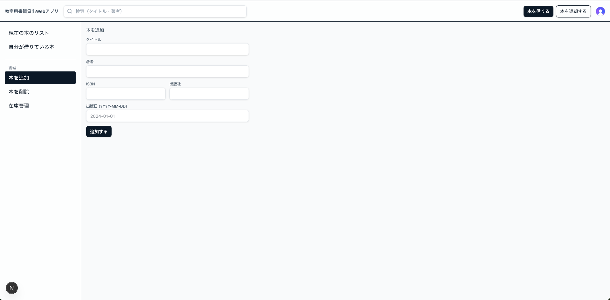
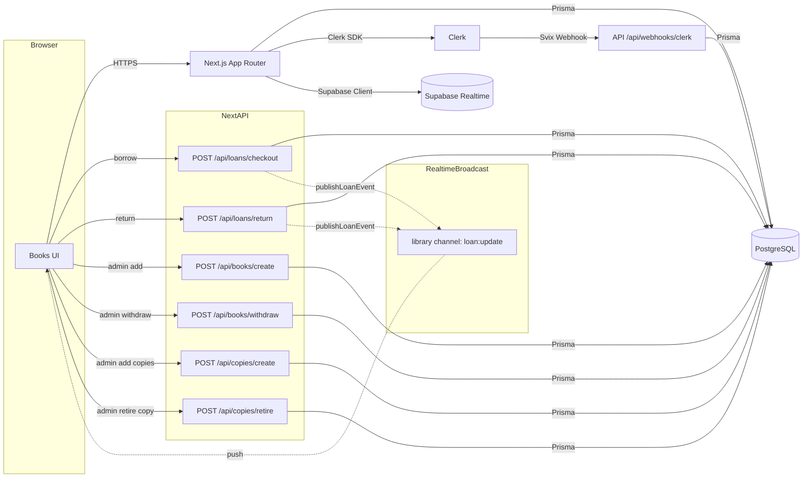
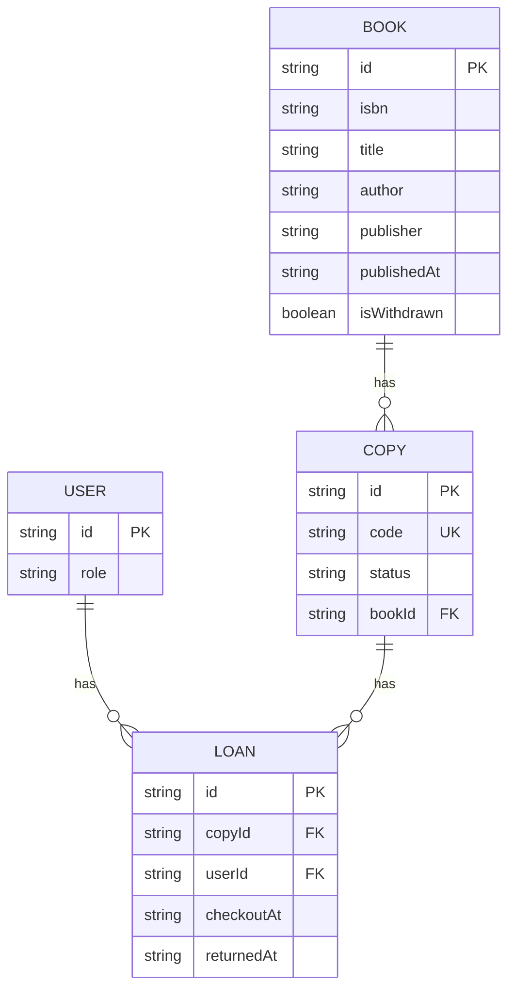

## Classroom Library App

教室向けの書籍管理・貸出・返却Webアプリケーションです。Clerkによる認証、Supabase Realtimeによる在庫更新、Prisma, PostgreSQL(Supabase Database)によるデータ永続化を採用しています。学生は書籍の閲覧・検索・貸出・返却ができ、管理者は書籍・在庫の管理を行えます。

## 開発の経緯

教室には、学生なら誰でも借りられる書籍が多数ありました。しかし、システムがない状態で貸出が進むにつれて、誰がどの書籍をいつ借りたのか分からなくなる問題が生じ、返却忘れや紛失、探索の手間が発生していました。そこで、誰が・いつ・どの本を借りて返したのかを記録・可視化して管理することで、これらの課題を解決したいと考え、開発しました。

## 主な機能

- 認証: Clerkでログイン/ログアウト、Webhookでユーザー作成時にアプリ内ユーザーを自動作成。
- 書籍一覧: タイトル/著者検索、在庫バッジ表示、貸出状況のリアルタイム反映。
- 貸出/返却: フォーム送信後は /books にリダイレクト。
- 管理機能: 書籍の追加・削除(Withdraw)、在庫の追加・無効化(LOST)。
- リアルタイム更新: Supabase Broadcastチャンネルで在庫ステータスを即時反映。

## 主要な画面

- `/books`: 書籍一覧(検索、在庫表示、管理タブ)
- `/borrow`: 貸出
- `/return`: 返却
- `/sign-in`: サインイン

※ 管理タブはADMINのみ表示され、書籍の追加/削除(Withdraw)、在庫の追加/無効化が可能です。

## スクリーンショット
- ホーム画面

- 貸出画面

- 返却画面

- 管理人画面


## 使用技術

### フロントエンド

- 言語: TypeScript
- フレームワーク: Next.js 15.5.9(App Router)
- スタイル: tailwind

### バックエンド

- 言語: TypeScript
- フレームワーク: Next.js 15.5.9(App Router)
- データベース: PostgreSQL(Supabase Database)
- ORM: Prisma
- 認証: Clerk

### 開発環境・インフラ
- IDE: Visual Studio Code
- バージョン管理: Git, GitHub

## 必要要件

- Node.js 18+(推奨 20+)
- PostgreSQL 接続先(例: Supabase)
- Clerk プロジェクト(Publishable/Secret Key、Webhook Secret)

## 環境変数 (.env.local)

```
# Supabase
NEXT_PUBLIC_SUPABASE_URL=...               # プロジェクトURL
NEXT_PUBLIC_SUPABASE_PUBLISHABLE_KEY=...   # クライアント公開キー
SUPABASE_SECRET_KEY=...                    # サーバ用シークレット

# DB 接続
DATABASE_URL=postgresql://...

# Clerk
NEXT_PUBLIC_CLERK_PUBLISHABLE_KEY=...
CLERK_SECRET_KEY=...

# Clerk Webhook
CLERK_WEBHOOK_SECRET=...
```

## セットアップ

1) 依存関係のインストール

```
npm install
```

2) Prisma クライアント生成 + マイグレーション

```
npm run prisma:generate
npm run prisma:migrate
```

3) 開発サーバーの起動(Webpack 推奨)

```
npm run dev:webpack
```

4) サーバー起動後、http://localhost:3000 でアプリにアクセスできます。

※ 初回ログイン時、ClerkのWebhookによりアプリ内ユーザー(Userモデル)が作成されます。管理者(ADMIN)権限はDBで手動更新するか、管理用UIを別途導入してください(現状は新規ユーザーはSTUDENTです)。

## 運用手順(Ops)

- 初期セットアップ
  - 環境変数を`.env.local`に設定。
  - `npm install && npm run prisma:generate && npm run prisma:migrate`

- 本番ビルド/起動
  - `npm run build:webpack` → `npm run start`

- 管理者権限の付与
  - Prisma Studio: `npx prisma studio`で`User.role`を`ADMIN`に変更。
  - もしくは SQL: `update "User" set role='ADMIN' where id='<clerk_user_id>';`

- データバックアップ/リストア（例: Supabase/PostgreSQL）
  - バックアップ: `pg_dump "$DATABASE_URL" > backup.sql`
  - リストア: `psql "$DATABASE_URL" < backup.sql`

- シークレットローテーション
  - ClerkのPublishable/Secret、Webhook Secretを更新→再デプロイ。
  - Supabaseの鍵を更新した場合も同様。

- 監視/ログ
  - アプリログ: Next.jsサーバープロセスの標準出力。
  - Webhook 失敗時: Clerkダッシュボードで確認。

## アーキテクチャ



## ER図



## 開発にあたって工夫した点
- ユーザー同期  
  Clerk Webhookを使用して、ユーザーが作成されたときに、自動でDBにユーザーが保存されるようにしました。また、Svix検証を行うように実装し、正しいリクエストのみ受けとるようにしました。

- DB設計の見直し  
  当初のDB設計では、同一の書籍を複数回貸出することができませんでした。しかしこれを、書籍情報(Book)と物理的な冊子(Copy)を分離し、さらに貸出ごとに一意なIDを持つLoanテーブルを導入することによって解決しました。

- 二重貸出の防止  
  2人がほぼ同時に貸出ボタンを押すと、二重貸出ができてしまう課題がありました。しかしこれを、未返却の書籍IDにユニークなインデックスを割り当てることにより解決しました。

- リアルタイム反映  
  貸出・返却の完了後に、libraryチャンネルでloan:updateイベントをbroadcast(例：{ copyId, status })します。
  ブラウザ側はRealtimeBridgeで購読し、在庫バッジや「自分の貸出」リストを即時更新します。ポーリングなしで最新状態を共有できます。

## 今後の展望

今後の展望アイデアは以下の通りです。

1. 登録・在庫管理の効率化
    - バーコード/QRで書籍登録。

2. 貸出・返却体験の向上
    - バーコードで貸出・返却。
    - 教室入口のタブレット専用画面からの貸出・返却(キオスクモード)。
    - 予約・取り置き機能。
    - 同時貸出上限、貸出延長回数などのポリシー化。

3. 通知・リマインド
    - 返却期限(前日/当日/超過時の通知)を通知。

4. 可視化・分析
    - 貸出人気ランキングの追加。
    - 貸出数、返却率、ピーク時間などをカード表示。

5. 連携・拡張
    - 書籍を借りた人のGoogle Calendarに返却期限を自動登録。
    - Slack/Teamsへ返却期限・入荷情報を投稿。
